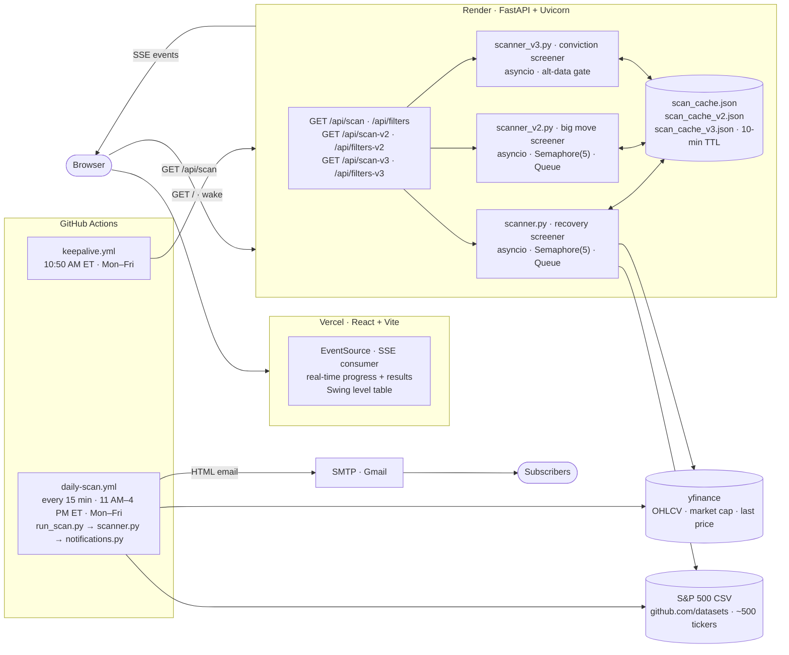

# StockScreener Pro

<p align="center">
  <a href="https://github.com/mehtakaran9/stock-screener/actions/workflows/daily-scan.yml">
    
  </a>
  <a href="https://github.com/mehtakaran9/stock-screener/actions/workflows/daily-scan.yml">
    
  </a>
  <a href="https://www.python.org/">
    
  </a>
  <a href="https://react.dev/">
    
  </a>
  <a href="https://www.typescriptlang.org/">
    
  </a>
</p>

A real-time technical stock screener with **three complementary strategies** for the S&P 500 universe. Scan results stream live to the browser via SSE and are emailed daily through a GitHub Actions cron job — no paid infrastructure required.

Switch strategies with the **Recovery Scan / Big Move Scan / Conviction Scan** tab in the UI:

| Strategy | Target setup | Key signals | SMA200 gate | Backtest |
|---|---|---|---|---|
| **Recovery Scan** (v1) | Panic selloff in structurally healthy stock | Day < −5%, RSI < 30, RVOL > 3.5×, EMA stack | Price **>** 75% of SMA200 (uptrend intact) | 70.5% 3-month win rate · +8.6% avg |
| **Big Move Scan** (v2) | Panic selloff into extreme dislocation | Day < −5%, RSI < 35, RVOL > 1.5× | Price **<** 70% of SMA200 (deep distress) | 33.32× lift · 14.56% precision · +39.3% avg on 30%+ moves in 42 days |
| **Conviction Scan** (v3) | Extreme dislocation + real-money confirmation | Day < −5%, RSI < 25, RVOL > 3.5×, candle ≥ 1.5× ATR, + alt-data | Price **<** 70% of SMA200 (deep distress) | Rare — ~3–4 signals/yr · targets 20%+ in 42 days |

> **Recovery Scan backtest** · 5-year S&P 500 · 666,534 ticker-days · 10-filter sweep
>
> | Metric | Value |
> |--------|-------|
> | 3-month win rate | **70.5%** |
> | Average 3-month return | **+8.6%** |
> | Signals per year | ~8 (full config, N=44 over 5 yrs) |
> | Recommended hold | 63 trading days (3 months) |

> **Big Move Scan backtest** · 10-year S&P 500 · 1.27M ticker-days · `bigmove_research.py`
>
> | Signal combo | Lift | Precision | Avg return |
> |---|---|---|---|
> | Day < −5% | 14.91× | 6.52% | +37.1% |
> | Price < 70% SMA200 | 10.17× | 4.45% | +37.0% |
> | **Day < −5% + Price < 70% SMA200** | **33.32×** | **14.56%** | **+39.3%** |
>
> Lift = precision ÷ base rate (0.437% — 1-in-228 chance of 30%+ in 42 days). Run: `python3 -m backend.bigmove_research`

> ⚠️ **Survivorship bias.** Both backtests draw the ticker universe from the *current* S&P 500
> constituent list and apply it across 5–10 years of history, so stocks that were delisted or
> dropped from the index never enter the sample. This systematically inflates win rate, lift, and
> average return versus a point-in-time universe. Treat the headline figures as upper bounds, not
> expected live performance. (RVOL is measured against the prior 20 completed days, excluding the
> signal day itself.)

---

## What it does

On each scan, the screener downloads 2 years of daily OHLCV data for up to 500 S&P 500 tickers and applies **10 filters** in sequence:

| # | Filter | Threshold | Rationale |
|---|--------|-----------|-----------|
| 1 | Day change | **< −5%** | Panic selloff — entry signal for mean-reversion |
| 2 | Market cap | **> $1 B** | Liquidity — eliminates micro/nano-caps |
| 3 | Price | **> $5** | Avoids penny stocks |
| 4 | Volume | **> 500 K shares** | Confirms real participation on the selloff day |
| 5 | RVOL | **> 3.5×** | Capitulation volume surge (panic, not routine selling) |
| 6 | RSI (14) | **< 30** | Extreme oversold / capitulation |
| 7 | SMA 200 | **Price > 75% of SMA200** | Structural uptrend still intact — not in freefall |
| 8 | EMA stack | **EMA20 > EMA50 > EMA200** | Macro trend aligned across all timeframes |
| 9 | SMA 50 | **Price ≤ 90% of SMA50** | Deep discount below 50-day trend — +3.8pp win rate vs. base (N=59) |
| 10 | Sector | **Excludes Health Care, Comm. Services, Utilities** | Empirically −10 to −17pp win rate on panic-selloff setups |

Tickers that pass all 10 filters are surfaced in the UI as potential recovery trade candidates and emailed every 15 minutes from 11 AM to 4 PM ET on NYSE trading days. Recommended hold: **63 trading days (3 months)**.

### Big Move Scanner (v2) — extreme dislocation recovery

Targets stocks already in severe distress (price < 70% of SMA200) that then have a further panic selloff day. The SMA200 gate is the **inverse** of the recovery screener — it finds stocks the recovery screener would reject. Both strategies share the same day < −5% trigger but serve opposite structural regimes.

| # | Filter | Threshold | Lift |
|---|--------|-----------|------|
| 1 | Day change | **< −5%** | 14.91× alone |
| 2 | Market cap | **> $1 B** | liquidity floor |
| 3 | Price | **> $5** | no penny stocks |
| 4 | Volume | **> 500 K shares** | participation check |
| 5 | RVOL | **> 1.5×** | volume confirmation |
| 6 | RSI (14) | **< 35** | oversold |
| 7 | SMA 200 | **Price < 70% of SMA200** | extreme dislocation — inverted from v1 |
| 8 | SMA 50 | **Price < 90% of SMA50** | below short-term MA too |

Entry and stop levels follow the same 3-scenario structure as v1 (wider stops: 1.5× and 2.5× ATR instead of 1.0× and 0.5×, reflecting higher volatility of distressed names). Results stream from `/api/scan-v2`; active filters load from `/api/filters-v2`.

Run the research backtest: `python3 -m backend.bigmove_research --window 42 --min-return 0.30`

Each result also includes computed entry / stop levels for the snap-back trade:

| # | Entry | Calculation | Stop | Calculation |
|---|-------|-------------|------|-------------|
| ① | Buy today | current price | Wide stop | price − 1.5 × ATR14 |
| ② | EMA8 reclaim | EMA8 value | Deep stop | price − 2.5 × ATR14 |
| ③ | BB-lower | BB lower band | Hard floor | price × 0.85 (−15%) |

Risk per share for each scenario is shown in the expanded row of the web UI table.

### Conviction Scanner (v3) — multi-factor + alt-data confirmation

Very selective — a handful of high-conviction signals per *year*, not per week: on 5½ years of S&P 500 history the technical gates triggered only ~20 times (≈3–4/yr), and the alt-data requirement filters further. In that sample ~60% went on to gain ≥ 20% within 42 trading days. These are stocks in the same extreme-dislocation regime as v2 (price < 70% of SMA200) but gated far more tightly **and** required to carry real-money confirmation. A ticker must clear every technical gate **and** score ≥ 1 on alt-data. Names reporting earnings within 7 days are skipped (binary-event risk). Results stream from `/api/scan-v3`; active filters load from `/api/filters-v3`.

| # | Filter | Threshold | vs. v2 |
|---|--------|-----------|--------|
| 1 | Day change | **< −5%** | same |
| 2 | Market cap | **> $1 B** | same |
| 3 | Price | **> $5** | same |
| 4 | Volume | **> 500 K shares** | same |
| 5 | RVOL | **> 3.5×** | tighter (v2: 1.5×) |
| 6 | RSI (14) | **< 25** | tighter (v2: 35) |
| 7 | SMA 200 | **Price < 70% of SMA200** | same (extreme dislocation) |
| 8 | SMA 50 | **Price ≤ 90% of SMA50** | same |
| 9 | ATR candle | **Body ≥ 1.5× ATR14** | new (extreme panic day) |
| 10 | Alt-data | **≥ 1 of** insider buy (30d) · earnings beat streak ≥ 2 · options call anomaly (put/call < 0.5) | new |

Each match adds four fields to the standard payload — `insider_buys_30d`, `earnings_beat_streak`, `options_call_anomaly`, `conviction_score` (0–3) — surfaced in the expanded row's **Conviction Signals** panel. Entry/stop levels mirror v2 (entry at price / EMA8 / BB-lower; stops 1.5× and 2.5× ATR plus a 15% hard floor). Alt-data sources are free by default — SEC EDGAR Form 4 (insider buys) and yfinance earnings — while the options put/call signal requires an optional `POLYGON_API_KEY`. Research backtest: `python3 -m backend.conviction_research`.

### Backtest calibration

The filter thresholds above were chosen empirically via a **full 5-year sweep** of every S&P 500 constituent (2021–2026):

| Step | Method | Outcome |
|------|--------|---------|
| Base sweep | 18 threshold combinations tested against 666K ticker-days | Best base: **RSI < 30, Day < −5%, RVOL > 3.5×, SMA200 > 75%, EMA stack** |
| Second-layer sweep | 10 additional filters tested on top of the base | `price ≤ 90% SMA50` adds **+3.8pp** (N = 59 signals) |
| Sector sweep | All 11 GICS sectors scored for 3-month win rate | Communication Services, Utilities, Health Care all underperform the **64% base** — excluded |
| Final result | Combined configuration | **70.5% 3-month win rate · +8.6% avg return** (N = 44) |

Run the backtest yourself: `python3 -m backend.reverse_backtest --refine --base-rsi 30 --base-rvol 3.5`

### API output fields

Every matched stock returns the following fields from `/api/scan`:

| Field | Description | Filter? |
|-------|-------------|---------|
| `ticker`, `exchange` | Symbol and listing exchange | — |
| `price`, `change` | Last price; day change % | change < −5% |
| `volume` | Day volume (shares) | > 500K |
| `vol_ratio` | Volume ÷ 20-day avg volume | > 3.5× (RVOL) |
| `market_cap` | Market capitalisation | > $1B |
| `rsi` | RSI(14) | < 30 (extreme oversold) |
| `macd`, `macd_signal`, `macd_hist` | MACD line, signal, histogram | informational |
| `ema8`, `ema20`, `ema50`, `ema200` | Exponential moving averages | EMA20 > EMA50 > EMA200 |
| `sma200` | 200-day simple moving average | price > 75% of SMA200 |
| `sma50` | 50-day simple moving average | price ≤ 90% of SMA50 |
| `bb_upper`, `bb_middle`, `bb_lower` | Bollinger Bands (20, 2) | informational |
| `atr14` | Average True Range (14) | — |
| `entry1/2/3` | Three recovery entry price levels | — |
| `stop1/2/3` | Corresponding stop loss levels | — |

> **`/api/scan-v2` returns the same 27 fields** with identical names and types. Filter thresholds differ (RSI < 35, RVOL > 1.5×, SMA200 gate inverted) but the JSON shape is identical — `StockTable` renders both without any changes. **`/api/scan-v3` returns the same 27 fields plus 4 conviction fields** (`insider_buys_30d`, `earnings_beat_streak`, `options_call_anomaly`, `conviction_score`).

---

## Architecture



- **GitHub Actions** owns the scheduled scan and email. `keepalive.yml` pings Render 10 minutes before the daily scan to avoid cold-start delays. `daily-scan.yml` runs four cron entries (EDT + EST) and guards against duplicate fires on DST transition weeks via `is_nyse_trading_day()`. Recipients are stored in the `EMAIL_LIST` Actions variable and written to `backend/recipients.txt` at runtime.
- **Render** hosts the FastAPI backend (512 MB RAM; sleeps after 15 min of inactivity). The keepalive ping ensures it is warm when the daily scan runs.
- **Vercel** serves the static React build. The browser connects directly to the Render backend via SSE for real-time scan progress. Three SSE endpoints exist: `/api/scan` (recovery), `/api/scan-v2` (big move), and `/api/scan-v3` (conviction); each has its own 10-minute result cache. `VITE_API_URL` wires up the Render service URL.
- **Tickers** are fetched from the [S&P 500 constituents CSV](https://github.com/datasets/s-and-p-500-companies) at scan time; a 10-ticker fallback list is used if the fetch fails.

---

## Local development

### Prerequisites
- Python 3.11+
- Node.js 20+

### Backend

```bash
python3 -m venv venv
source venv/bin/activate          # Windows: venv\Scripts\activate
pip install -r backend/requirements.txt

uvicorn backend.main:app --reload
# API available at http://localhost:8000
```

### Frontend

```bash
cd frontend
npm install
npm run dev
# UI available at http://localhost:5173
```

The frontend talks to `http://localhost:8000` by default (`VITE_API_URL` unset).

### Running tests

```bash
# Backend
python3 -m pytest backend/ -v

# Frontend
cd frontend && npm run test
```

---

> For cloud deployment instructions see [DEPLOY.md](DEPLOY.md).

---

## Adding to the subscriber list

The daily scan email is sent to everyone in the `EMAIL_LIST` GitHub Actions variable. There are two ways to add a recipient:

### Option 1 — Admin: edit the variable directly

Go to **Settings → Secrets and variables → Actions → Variables tab → EMAIL_LIST → Edit** and append the address (one per line). Takes effect on the next workflow run.

### Option 2 — Public request via GitHub Issues

This repo has a structured issue form that lets anyone request to be added without exposing their email publicly.

**As a subscriber:**
1. Open a new issue using the **Subscribe to Daily Scan Email** template.
2. Check the consent boxes and submit — do not include your email address in the issue.
3. A maintainer will approve the request and contact you privately via your GitHub notification email to collect your address.

**As the admin (after receiving the address privately):**
1. Go to **Actions → Add Email Subscriber → Run workflow**.
2. Enter the email address and optionally the issue number (to auto-close it with a confirmation comment).
3. Click **Run workflow** — the `EMAIL_LIST` variable is updated immediately.

---

## Email format

Scan results are delivered as a dark-themed HTML email that mirrors the web UI:

- **Tickers** are hyperlinked to their Google Finance page (`google.com/finance/quote/AAPL:NASDAQ`)
- **Change %** is colour-coded: teal for gains, red for losses
- **Volume** and **Market Cap** use compact notation (`52.30M`, `3.29T`)
- Columns: Ticker · Price · Change % · Volume · Market Cap · RSI · MACD
- When `full_scan=false, send_email=true` is triggered, an amber banner labels the data as a test

The web UI exposes all output fields (see table above) and adds an expandable row per ticker showing MA chips, Bollinger Band levels, and the full swing trade levels table (3 scenarios: **Breakout (now)** · **EMA 8 pullback** · and a deep-value third level that adapts to the active strategy — **SMA200 test** in Recovery mode, **BB lower** in Big Move / Conviction mode). The email (Recovery only) intentionally sends just the 7 summary columns.

---

## Key dependencies

| Package | Purpose |
|---------|---------|
| `fastapi` + `uvicorn` | Async HTTP server with SSE streaming |
| `yfinance` | OHLCV data downloads + market cap via `fast_info` |
| `pandas` | DataFrame-based OHLCV processing and rolling indicator windows |
| `pandas-ta-classic` | EMA / SMA calculation (NumPy 2.0 compatible fork) |
| `pandas-market-calendars` | NYSE trading-day check |
| `rich` | Coloured terminal logging |
| `requests` | S&P 500 constituents CSV fetch |
| `pytz` | Timezone handling for ET cron logic |
