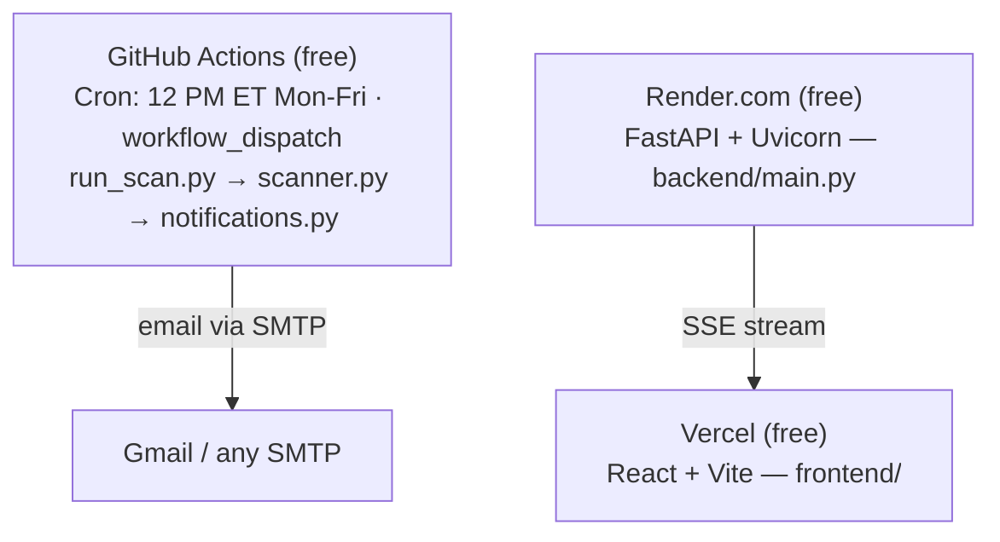

# StockScreener Pro

<p align="center">
  <a href="https://github.com/mehtakaran9/stock-screener/actions/workflows/daily-scan.yml">
    
  </a>
  <a href="https://www.python.org/">
    
  </a>
  <a href="https://react.dev/">
    
  </a>
  <a href="https://www.typescriptlang.org/">
    
  </a>
</p>

A real-time technical stock screener that identifies momentum breakout setups across the S&P 500 universe. Scan results stream live to the browser via Server-Sent Events and are emailed daily through a GitHub Actions cron job — no paid infrastructure required.

---

## What it does

On each scan, the screener downloads 2 years of daily OHLCV data for up to 500 S&P 500 tickers and applies eleven filters in sequence:

| Filter | Threshold | Rationale |
|--------|-----------|-----------|
| Day change | > 3% | Momentum — significant single-day move |
| Market cap | > $1 B | Liquidity — eliminates micro/nano-caps |
| Price | > $5 | Avoids penny stocks |
| Volume | > 500 K shares | Confirms institutional participation |
| SMA 200 | Price > 75% of SMA200 | Stock is in a long-term uptrend |
| EMA 8 | Price > 80% of EMA8 | Stock is near near-term momentum, not extended |
| RSI (14) | 50 – 70 | Momentum confirmed without being overbought |
| MACD histogram | > 0 | Bullish crossover active (MACD line above signal) |
| EMA 50 | Price > EMA50 | Medium-term uptrend intact |
| EMA 200 | Price > EMA200 | Long-term uptrend intact |
| Bollinger Band | Price < BB upper (20, 2) | Not overextended above the upper band |

Tickers that pass all eleven filters are surfaced in the UI as potential swing trade candidates and emailed at 12 PM ET on NYSE trading days.

Each result also includes computed swing trade levels:

| # | Entry | Calculation | Stop | Calculation |
|---|-------|-------------|------|-------------|
| ① | Breakout now | current price | Tight | price − 1.0 × ATR14 |
| ② | EMA8 pullback | EMA8 value | EMA8 undercut | EMA8 − 0.5 × ATR14 |
| ③ | BB midline dip | BB middle (SMA20) | Trend break | SMA50 − 0.5 × ATR14 |

Risk per share for each scenario is shown in the expanded row of the web UI table.

### API output fields

Every matched stock returns the following fields from `/api/scan`:

| Field | Description | Filter? |
|-------|-------------|---------|
| `ticker`, `exchange` | Symbol and listing exchange | — |
| `price`, `change` | Last price; day change % | — |
| `volume` | Day volume (shares) | ≥ 500K |
| `vol_ratio` | Volume ÷ 20-day avg volume | informational |
| `market_cap` | Market capitalisation | > $1B |
| `rsi` | RSI(14) | 50 – 70 |
| `macd`, `macd_signal`, `macd_hist` | MACD line, signal, histogram | hist > 0 |
| `ema8`, `ema50`, `ema200` | Exponential moving averages | price > EMA50, price > EMA200 |
| `sma50`, `sma200` | Simple moving averages | price > 75% of SMA200 |
| `bb_upper`, `bb_middle`, `bb_lower` | Bollinger Bands (20, 2) | price < BB upper |
| `atr14` | Average True Range (14) | — |
| `entry1/2/3` | Three swing entry price levels | — |
| `stop1/2/3` | Corresponding stop loss levels | — |

---

## Architecture



- **GitHub Actions** owns the scheduled scan and email. Two cron entries handle EDT/EST daylight-saving transitions; `is_nyse_trading_day()` guards against duplicate fires on transition weeks. Recipients are stored in the `EMAIL_LIST` Actions variable (one address per line) and written to `backend/recipients.txt` at runtime.
- **Render.com** hosts the FastAPI backend on the free tier (512 MB RAM; sleeps after 15 min inactivity).
- **Vercel** hosts the static React build. `VITE_API_URL` points to the Render service.
- **Tickers** are fetched from the [S&P 500 constituents CSV](https://github.com/datasets/s-and-p-500-companies) at scan time; a 10-ticker fallback list is used if the fetch fails.

---

## Local development

### Prerequisites
- Python 3.11+
- Node.js 18+

### Backend

```bash
python3 -m venv venv
source venv/bin/activate          # Windows: venv\Scripts\activate
pip install -r backend/requirements.txt

uvicorn backend.main:app --reload
# API available at http://localhost:8000
```

### Frontend

```bash
cd frontend
npm install
npm run dev
# UI available at http://localhost:5173
```

The frontend talks to `http://localhost:8000` by default (`VITE_API_URL` unset).

### Running tests

```bash
python3 -m pytest backend/ -v
```

---

> For cloud deployment instructions see [DEPLOY.md](DEPLOY.md).

---

## Adding to the subscriber list

The daily scan email is sent to everyone in the `EMAIL_LIST` GitHub Actions variable. There are two ways to add a recipient:

### Option 1 — Admin: edit the variable directly

Go to **Settings → Secrets and variables → Actions → Variables tab → EMAIL_LIST → Edit** and append the address (one per line). Takes effect on the next workflow run.

### Option 2 — Public request via GitHub Issues

This repo has a structured issue form that lets anyone request to be added without exposing their email publicly.

**As a subscriber:**
1. Open a new issue using the **Subscribe to Daily Scan Email** template.
2. Check the consent boxes and submit — do not include your email address in the issue.
3. A maintainer will approve the request and contact you privately via your GitHub notification email to collect your address.

**As the admin (after receiving the address privately):**
1. Go to **Actions → Add Email Subscriber → Run workflow**.
2. Enter the email address and optionally the issue number (to auto-close it with a confirmation comment).
3. Click **Run workflow** — the `EMAIL_LIST` variable is updated immediately.

---

## Email format

Scan results are delivered as a dark-themed HTML email that mirrors the web UI:

- **Tickers** are hyperlinked to their Google Finance page (`google.com/finance/quote/AAPL:NASDAQ`)
- **Change %** is colour-coded: teal for gains, red for losses
- **Volume** and **Market Cap** use compact notation (`52.30M`, `3.29T`)
- Columns: Ticker · Price · Change % · Volume · Market Cap · RSI · MACD
- When `full_scan=false, send_email=true` is triggered, an amber banner labels the data as a test

The web UI exposes all output fields (see table above) and adds an expandable row per ticker showing MA chips, Bollinger Band levels, and the full swing trade levels table. The email intentionally sends only the 7 summary columns.

---

## Key dependencies

| Package | Purpose |
|---------|---------|
| `fastapi` + `uvicorn` | Async HTTP server with SSE streaming |
| `yfinance` | OHLCV data downloads + market cap via `fast_info` |
| `pandas-ta-classic` | EMA / SMA calculation (NumPy 2.0 compatible fork) |
| `pandas-market-calendars` | NYSE trading-day check |
| `rich` | Coloured terminal logging |
| `requests` | S&P 500 constituents CSV fetch |
| `pytz` | Timezone handling for ET cron logic |
